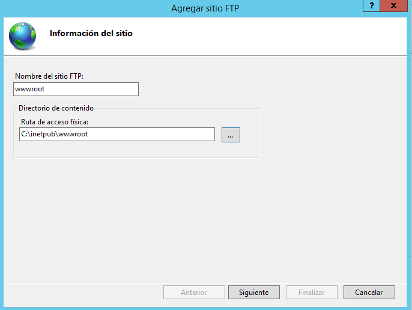
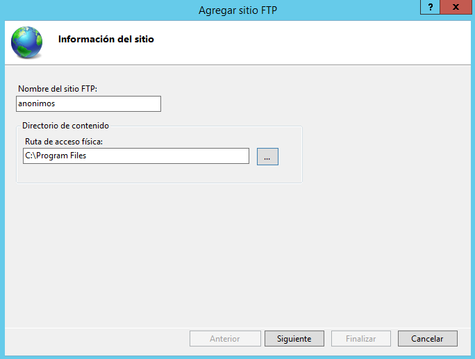
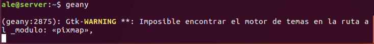

# 1. Servicio FTP en Windows

### 1.1 Instalación del servicio

### 1.2 Creación del primer sitio FTP

### 1.3 Comprobación del primer sitio en Navegador y explorador de archivos

### 1.4 Comprobación de entrada con otro usuario no autorizado

### 1.5 Comprobación desde cliente Windows

### 1.6 Instalación y uso de WinSCP

### 1.7 Creación y prueba de sitio con certificado SSL

### 1.8 Creación y prueba de sitio para usuarios anonimos.

# 2. Servicio FTP en Linux

### 2.1 Configuración servidor SSH

* Debemos tener en cuenta que las opciones `X11Forwarding` tenga el parametro `yes` y que `X11DisplayOffset` también este descomentada para poder ejecutar aplicaciones a nivel de entorno gráfico en máquinas remotas.

### 2.2 Comprobación de acceso mediante SSH desde máquina cliente

### 2.3 Ejecución de una aplicación gráfica instalada en el servidor desde el cliente

### 2.4 Acesso al servidor mediante sftp y carga y descarga de archivos

### 2.5 Instalación del paquete proftpd

### 2.6 Visualizar el fichero /etc/proftpd/proftpd.conf

### 2.7 Conexión al servicio ftp desde servidor y cliente

