# Servidor de correo Linux

## Instalación del servicio SMTP

* Iniciamos la instalación del servicio `Postfix` mediante el comando:

```console

apt-get install Postfix

```

* En madio de la instalación nos saldrá esta especie de asistente.

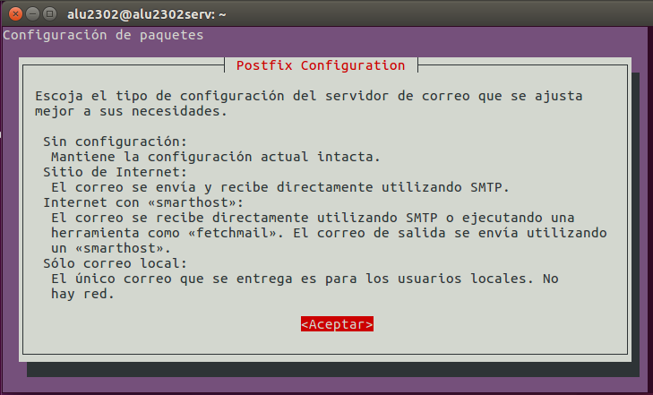

* Escoger instalación como Sitio de Internet

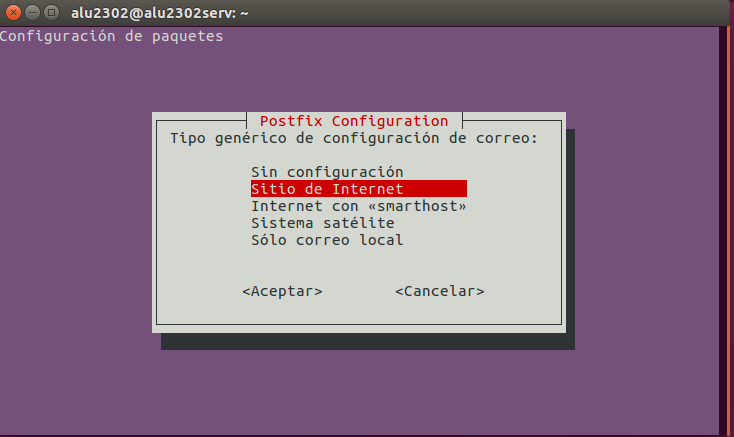

* Creamos dominio miempresa.edu

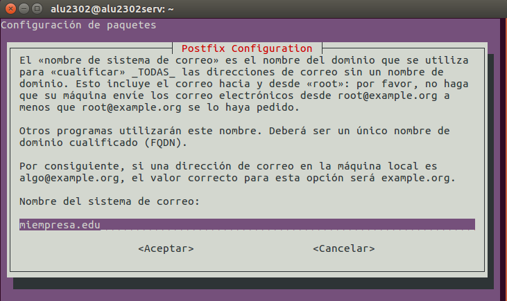

* Una vez terminada la instalación, comprobamos servicio (y puerto) SMTP activo y a la escucha con `netstat– utap`

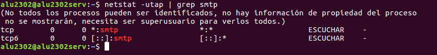

* Realizar  una  prueba  de  envío  de  mensaje  entre  dos  usuarios  del  sistema  mediante
telnet.

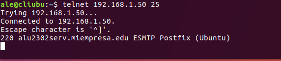

* Comprobamos que ahora ya nos han asignado un puerto para la conexión.

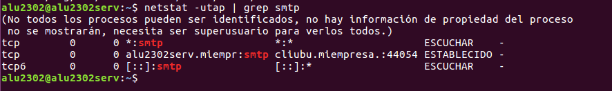

* Completamos el mensaje y comprobamos que está dentro de la carpeta de `/var/mail/` del usuario.

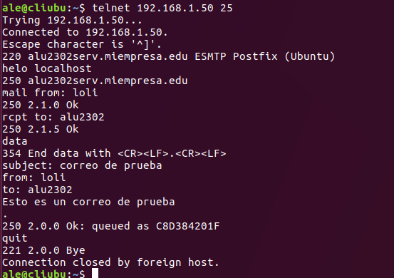

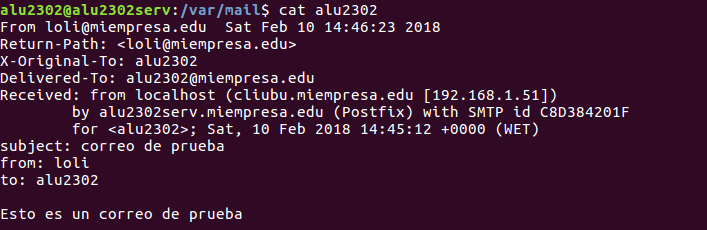

* Instalamos un cliente de correo electrónico en un cliente.

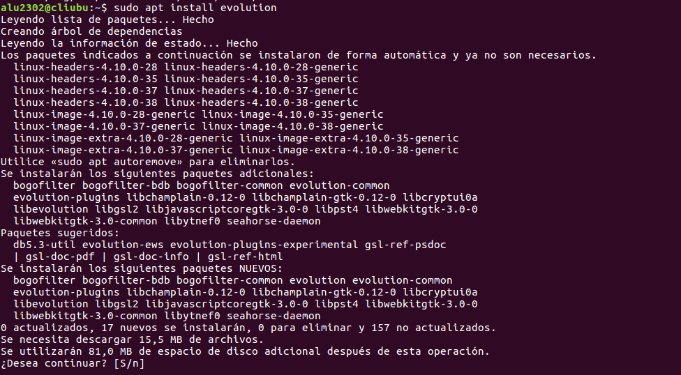

* Crear  dos  nuevas  entradas  en  /etc/hosts:  smtp.miempresa.edu  y  pop.miempresa.edu
asociadas a la IP del servidor.

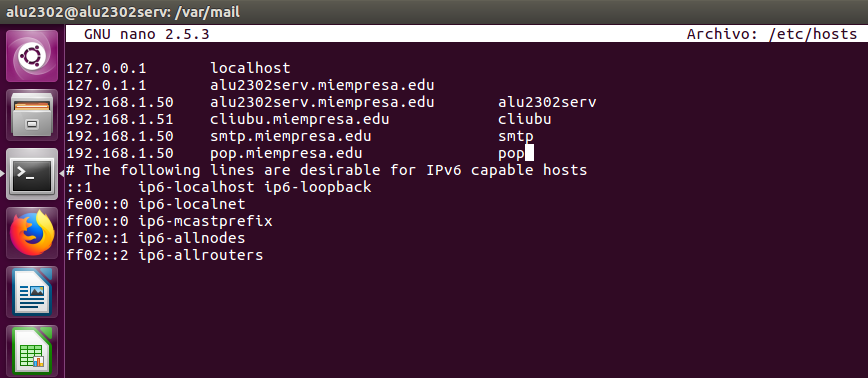

* Crear al menos dos cuentas asociadas a usuarios existentes en el servidor y asociadas al
dominio creado en Postfix.

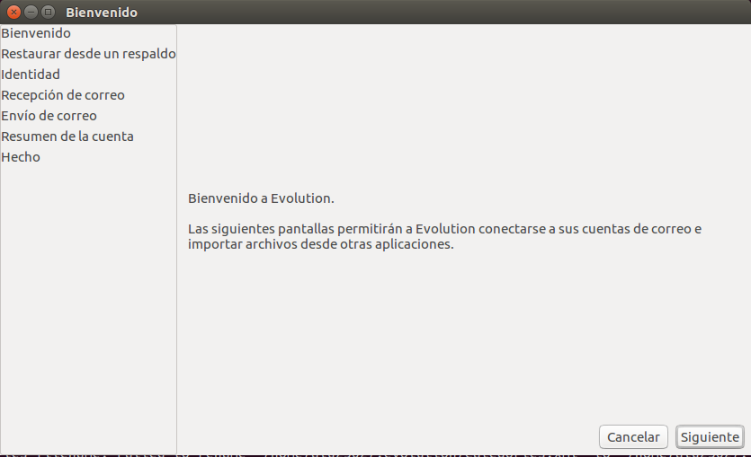

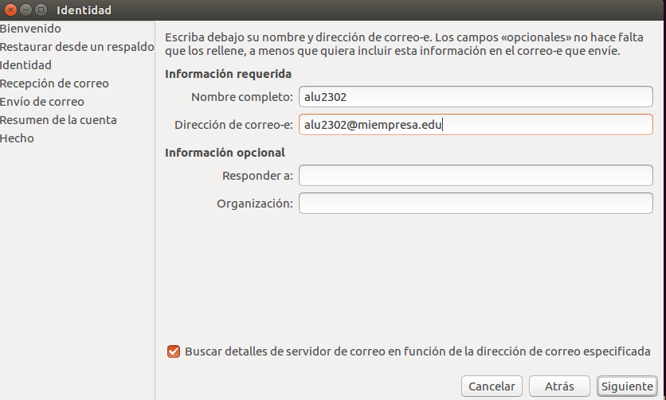

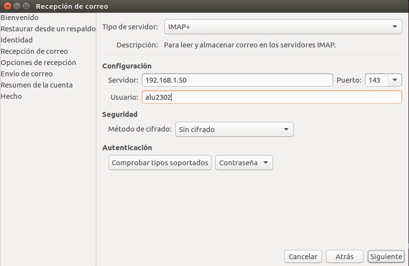

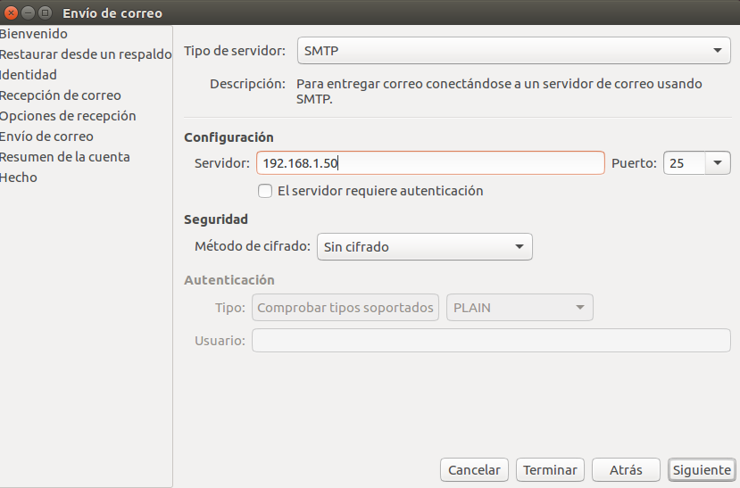

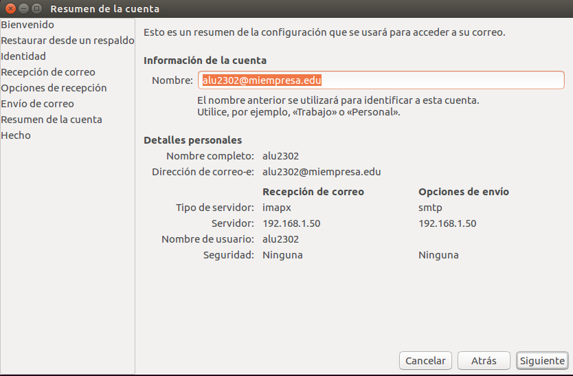

* Enviamos un mensaje de un usuario a otro.

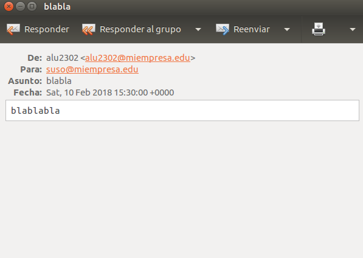

* Comprobamos que el mensaje se encuentra en el directorio del usuario.

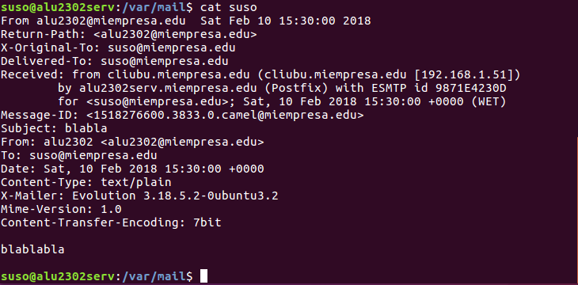

## Instalación del servicio IMAP

* Instalar servicio IMAP con:

```console

apt-get install dovecot-imapd

```

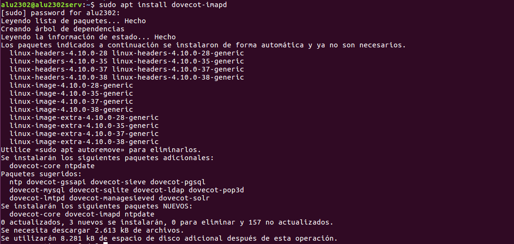

* Comprobar servicio (y puerto) IMAP activo y a la escucha con `netstat –utap`

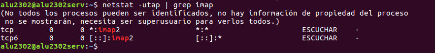

* Instalar aplicación correo web SquirrelMail.

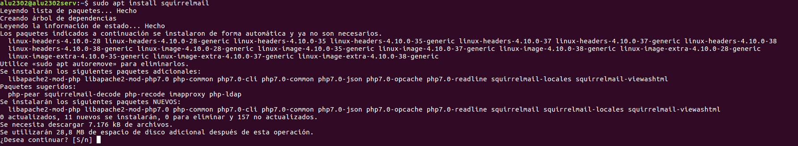

* Carpeta de configuración en /etc/squirrelmail

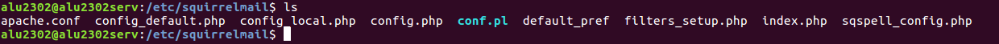
